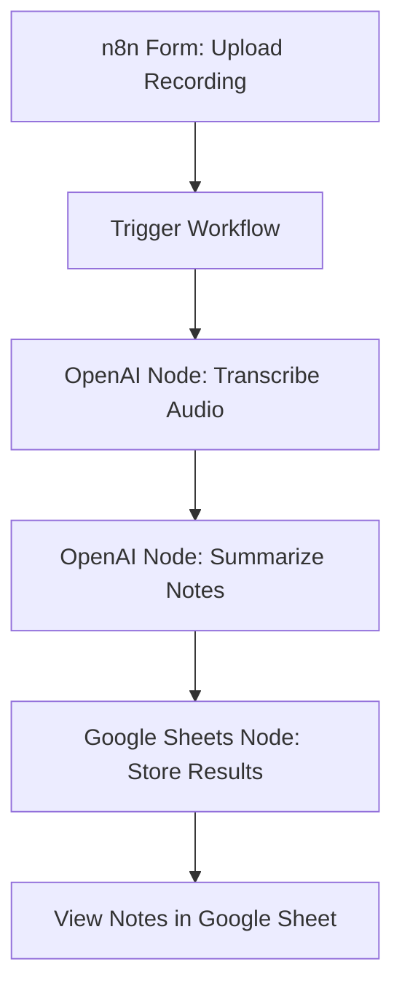

# 📄 n8n Meeting Workflow

This project is an **automated meeting transcription and logging workflow** built with [n8n](https://n8n.io).  
It allows you to upload meeting recordings (e.g., MP3 files) via an n8n form, process them with OpenAI, and automatically store the summarized notes in a Google Sheet.

Think of it as your **AI-powered meeting assistant** that turns recordings into structured notes — all without writing a single line of code. 🚀

---

## ✨ Features

- 🎤 Upload meeting recordings through a simple n8n form
- 🤖 Transcribe & analyze content using **OpenAI API**
- 📊 Store final outputs automatically in **Google Sheets**
- 🔑 Secure authentication using **Google OAuth**
- 🛠️ Easy to extend — you can add steps for notifications, summaries, or CRM updates

---

## 🛠️ Prerequisites

Before setting up the workflow, you’ll need:

1. **OpenAI API Key**

   - Sign up at [OpenAI](https://platform.openai.com)
   - Copy your API key

2. **Google OAuth Client** (with credentials set up)

   - Go to [Google Cloud Console](https://console.cloud.google.com)
   - Create OAuth credentials and save the **Client ID** and **Client Secret**

3. **Google Spreadsheet** (as output destination)

   - Make a copy of this sample sheet: [📄 Google Sheet Template](https://docs.google.com/spreadsheets/u/1/d/14BvEzVVxExSyqQaNibzQVZy2v5YcDqLDZR8T3b4gVh8/copy)
   - Extract the **Sheet ID** from the URL
     ```
     Example: https://docs.google.com/spreadsheets/d/1b8a2GnLOjHHRXi_5xelKsU87DYEUuq8TP-h1FjkcL9c/edit?gid=0
              └────────────── Sheet ID ──────────────┘
     ```

4. (Optional) **recall.ai API key** – only needed if you want to integrate live meeting bots in the future.

---

## 📥 Setup Instructions

1. **Import Workflow**

   - Download the workflow JSON:  
     [meeting_workflow.json](https://raw.githubusercontent.com/roshanmishra86/building/refs/heads/main/module2/form_trigger_workflow.json)
   - In n8n, go to **Workflows → Import from File/URL** and load this JSON.

2. **Configure API Keys**

   - Add your **OpenAI API Key** inside the OpenAI nodes.
   - Add your **Google Client ID & Secret** and link with OAuth.
   - Enter the **Google Sheet ID** inside the Spreadsheet nodes.

3. **Test with Sample Recording**

   - Download this sample meeting audio:  
     [output_5min.mp3](https://github.com/roshanmishra86/building/blob/main/module2/output_5min.mp3)
   - Upload it via the n8n form to trigger the workflow.

4. **Run Your Own Recording**
   - Upload your own meeting MP3 file instead of the sample.
   - The workflow will automatically process and push the results to your Google Sheet.

---

## 🖼️ Workflow Diagram

Here’s how the workflow operates step by step:



✅ Output:

1.A structured record of your meeting stored inside your linked Google Sheet (timestamps, transcript, summary, etc.)

📌 Notes & Tips:
1.Make sure your Google OAuth credentials have Sheets API enabled.
2.For longer meetings, consider breaking recordings into smaller chunks.
3.You can extend this workflow by:
Sending summaries to Slack / Email
Logging notes into a CRM
Creating action item tasks automatically

🔮 Future Improvements:
1.Add live meeting integration with recall.ai
2.Generate action items & key decisions with GPT models
3.Multi-language transcription support
4.Export outputs into Notion or Confluence
